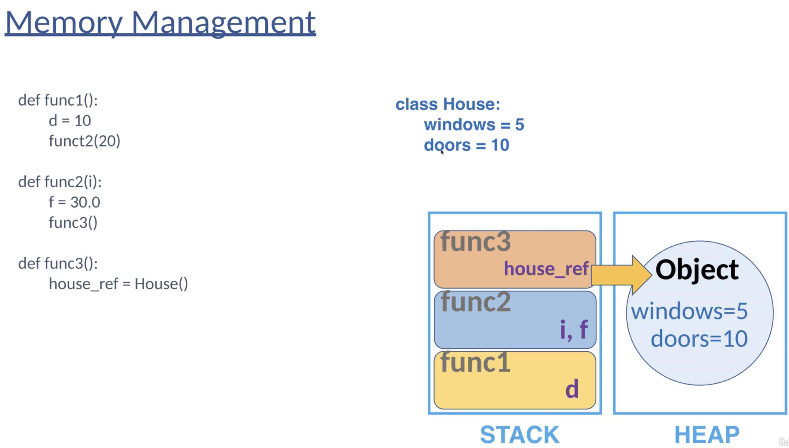
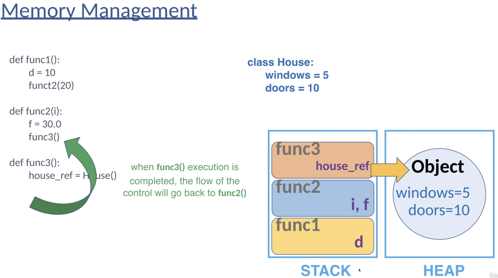
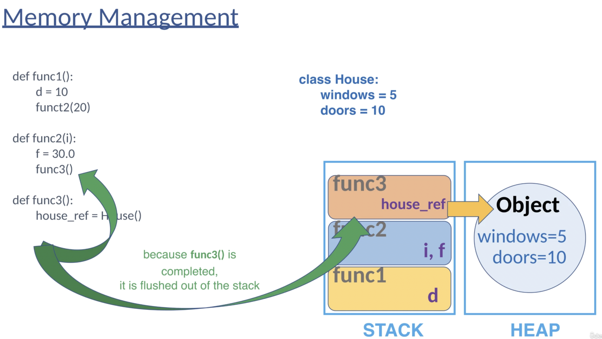
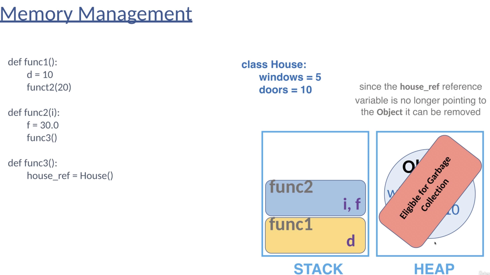
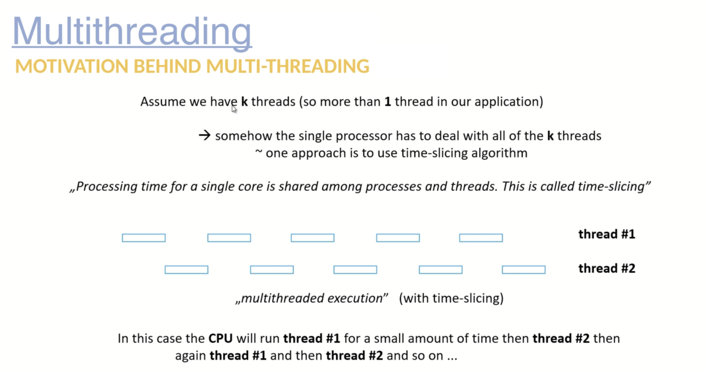
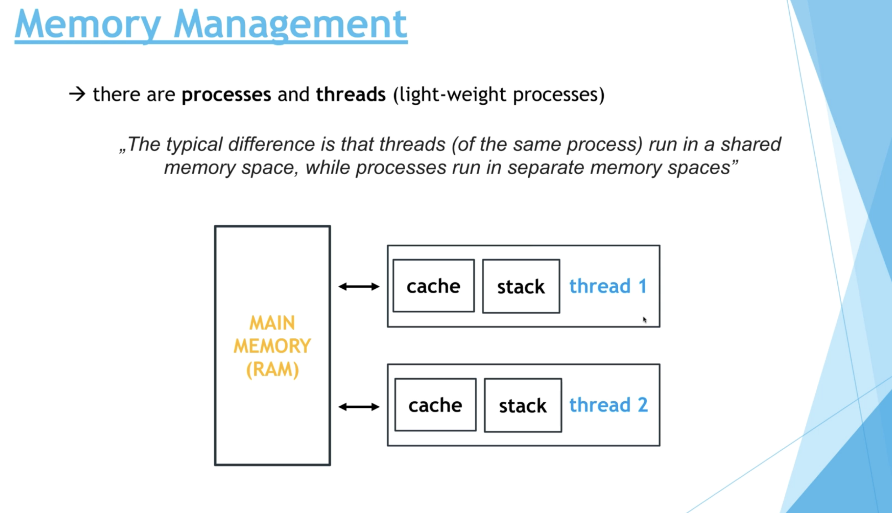

# Python Programming - Multithreading, OOP, NumPy and Pandas

[Udemy](https://udemy.com/course/python-programming-basics-multithreading-oop/)

## Why Python?

- Python is a high level programming language developed by Guido
  van Rossum back in 1985 - 1990

- It was designed to be highly readable: it is one of the easiest
  programming languages to start with

Python programming language

- Python is an interpreted programming language
- It means that the code is interpreted and processed at run-time: there is no need for compiling the program
- It is an object oriented programming language: it may encapsulate code iwthin given classes and objects
- Easy to use with all the major databases

Python fundamentals

- Variables, loops and operators
- Functions
- Basic data structures
- Memory management
- Object Oriented Programming (OOP)
- I/O
- Exceptions and errors

Functions

In computer science and programming, a function is a block of
statements that performs a specific task

- `return`: send a specific value (object) back to it's caller
- `yield`: can produce a sequence of values (objects). It can
  resume execution

Function stop with `return`

```py
def producer():
    for num in range(0,10,1):
        if num % 2 == 0:
            return num

print(producer())
```

Using `yield`

```py
def producer():
    for num in range(0,10,1):
        if num % 2 == 0:
            yield num

for n in producer():
    print(n)
```

## Data Structures in Python

### How to measure the running time of algorithms

Running time of algorithms (Complexity theory)

- It is quite hard to define the running time of a given
  algorithm - because it depends on the underlying hardware
- So maybe measuring the running time is not the best option
- Better approach: measure the `number of steps` instead - how many
  steps a given algorithm requires with respect to the input

Ex: we want to sort an array with `N` items. How many steps does
the given sorting algorithm requires?

- `O(1)` - constant running time complexity: these algorithms are
  the fastest approaches: the running time is independent of the
  `N` input (number of items)

  - Ex: we want to `swap` two items with known indexes in a
    given one-dimensional array
  - So if we know the indexes of given items, then basically
    swapping them is quite easy and quite fast

- `O(N)` - linear running time complexity: these algorithms running
  time scale linearly with the `N` input so the running time
  increases linearly with the size of the input. If we have `2x`
  the size of the input then the running time will be `2x` as well.

  - Ex: Using linear search to find an unknown item in a 1D array

- `O(logN)` - logarithmic running time complexity: these algorithm
  running time scale logarithmically with the `N` input so the
  running time increase logarithmically with the size of the input.

  - Ex: if we want to find an unknown item in a `sorted` 1D array (binary search)

### Data structures

- We can store data effieiently with data structures
- But why to bother with data structures in the main?

> Bad programmers worry about the code, good programmers
> worry about data structures and their relationships

- We may have the wrong intuition: we have to use complex
  optimization techniques to make an algorithm faster, etc.

> We can make algorithms faster with proper data structures!!!

- The essence of data structures is that they can store data
  in an efficient manner - opertaions such as insertion or removal

- So data structures have a huge impact on the final running time
  of given softwares and applications

## Memory Management

### Stack and Heap memory?

There are 2 main types of memory:

- Stack memory
- Heap memory

The stack memory (underlying is `stack` data structure)

- The stack memory is a special region in the `RAM` (random
  access memory).

- This is a special data type (stack) that
  store the `active functions` and `local variables` as well.

- This is how Python knows where to return after finish execution
  of a given function

- Small size, fast access, stores function calls and local variables, no fragmentation

The heap memory (nothing concern with the `heap` data structure)

- The heap memory is a special region in the RAM (random
  access memory) as well

- THe size of the heap memory is way larger than that of the stack
  memory (we can store more items)

- `Objects` are store on the heap memory

- Large size, slow access, stores objects, may become fragmented

### Simulation









### Garbage Collection (GC)

In Python, we do not have to bother with objects on the `heap`
memory. The garbage collectioin will remove unused objects.

Where there are no active `references` from the `stack` memory to
a given object on the heap - it becomes eligible for garbage
collection. There are several algorithms to handle this problem
and Python uses the so-called `reference counting` approach.

Every variable in Python is a `reference` to an `object`.
A single object may have several references (variable names)

```py
a = ['kenvin', 23, True]
b = a
c = b

# the list object have 3 references
```

In this case, there are 3 references (a, b, c) to the same object
(`list`).

Every object in Python has an extra field - the `reference counter`
that is increased (decreased) when a pointer to the object is
created (removed)

If the reference counter reaches zero, it means that the garbage
collector can `remove that object` from the `heap memory`

The garbage collection is the process that removes unused and
unreferenced objects from the heap

```py
del a
```

The `del` keyword decrements the reference counter (note that there may be other references to the object)

### Revisiting the types of variables

Most of the variables in Python are objects

How to check whether a given variable is an object or not

```py
a = 'Kenvin'
b = 10
c = 34.5
d = False

print(type(a))
print(type(b))
print(type(c))
print(type(d))

# these variables are stored in the heap memory
print(isinstance(a, object)) # true
print(isinstance(b, object)) # true
print(isinstance(c, object)) # true
print(isinstance(d, object)) # true
```

The object is stored on the heap memory, but the variable, so the
reference is stored on the stack memory and of course the
variable on the stack memory is pointing to the object on the
heap memory. And in Python, most of the variables are like this.

### The `==` and the `is` operator

The `==` operator compares the values

````py
a = [10, 'Kevin', True, 35.6]
b = [10, 'Kevin', True, 35.6]

print(a == b) # True

name1 = 'Adam Smith'
name2 = 'Adam Smith'

print(name1 == name2)

The `is` operator compare the memory locations

```py
a = [10, 'Kevin', True, 35.6]
b = [10, 'Kevin', True, 35.6]
c = a

print(a is b) # False
print(c is a) # True
````

### Call by reference and value

There is a crucial difference in programming between
`call-by-reference` and `call-by-value`

`call-by-value`: just a copy of the original variable is passed
so the original variable will not be changed (C, C++, Java).

```py
def change(x):
    # x is a copy of a
    # change x, not a
    x = x + 1

a = 10
change(a)
print(a)
```

`call-by-reference`: the variable itself is passed so the original
variable may be altered

The Python programming language is something different: here we
are using `pass-by-object-reference`. It depends on wheter
the variable is `mutable` or `immutable`

- `int`, `float`, `strings` are `immutable` objects in Python - this is why we are not able to change the values

```py
def change(x):
    x = x + 1

a = 10
change(a)
print(a)
```

- Python is able to change the values of mutable objects. Python
  has something to do with `pass by object reference`

```py
def add_item(l):
    l.append('This is a new item')

my_list = ['kevin', 10, True]
add_item(my_list)

# my_list changed
print(my_list)
```

## Multithreading Theory

### What are processes and threads?

Motivation behind multi-threading

By default, programming languages are `sequential`, they
execute the statements and commands one by one (line by line)

```py
init()
download()
initModel()
makePrediction()
```

In single threaded application, these methods will be called one
by one. We have to wait for them to finish one by one.

It's not the best solution possible, time consuming operations
may freeze the application and the users may not know what's
happening!!!

The most relevant reason for `multithreading` is to seperate
multiple tasks. One ore more which is time critical and might
be subject to interference by the execution of other tasks.

For example: our stock market related software is able to download
data from the web (Yahoo Finance for example)

- It takes 2-3 mins to fetch the data BUT we want to make sure
  the application is not frozen!!!
- Solution: we create a distinct thread for the download operation
  and during this procedure the user can do whatever he/she wants
  in the application

Example

- Thread #1: downloading images from the web
- Thread #2: IO operations: copying files and parse the content
- Thread #3: Doing heavy calculations: simulations or
  numerical methods (differential equations)

Multithreading is the ability of the CPU to execute multiple
processes or threads concurrenty. Both `process` and `threads`
are independent sequances of execution

Process

- a `process` is an `instance` of program execution
- when you open a software or web browser: there are distinct
  process
- the `OS` assigns distinct register, program counter,
  stack memory and heap
  memory to every single process
- In Java, we can create processes with the help of
  `ProcessBuilder` class

Threads

- a `thread` is a `light-weight` process
- It is a unit of execution within a given process (a process
  may have several threads)
- Each thread in a process `shares` the memory and resources and
  this is why programmers have to deal with concurrent
  programming and multithreading (synchronization)
- Creating a new thread requires fewer resources than creating
  a new process

Example

- Process 1

  - resources: registers, stack memory, heap memory, etc.
  - #1 thread
  - #2 thread
  - #3 thread
  - ...
  - #n thread

- Process 2
  - resources: registers, stack memory, heap memory, etc.
  - #1 thread
  - #2 thread
  - #3 thread
  - ...
  - #n thread

Assume we have `k` threads (so more than `1` thread in our
application)

Somehow the single processor has to deal with all of the `k`
threads ~ one apporach is to use `time-slicing` algorithm

Processing time for a single core is shared among processes and
threads. This is called time-slicing

In this case, the CPU will run `thread #1` for a small amount
of time then `thread #2` then again `thread #1` and then
`thread #2` and so on...



### The `time-slicing` algorithm


### Benefits of multithreading

We can design more responsive applicatoin: we can do several
operatioins concurrently

We can achieve better resource utilization (CPU utilization
for example). By default, every Java program is single threaded,
there may be several processor cores which we do not utilize
without using multiple threads

Overall we can improve performance. Performance improvement has
something to do with multiple cores and parallel computing so
we'll discuss it in that chapter.

### Downside of multithreading

> Multithreading is not always better!!!

Threads manipulate data located on the same memory area because
they belong to the same process and we have to deal with this
fact (`synchronization`)

It's not easy to design multithreaded applications (easy to make
bugs/hard to detect bugs) ~ with modern frameworks (`fork-join`).
It's getting easier

Expensive operation: switching threads is expensive. CPU has to
save local data, application poiter etc. of the current thread
and has to load the data of the other thread as well.

It's expensive to switch between threads: this is why using
threads is not always the fastest way possible (for example
sorting algorithms)

> Rule of thumb: for small problems, it is unnecessary to use
> multithreading

### Multithreading implementations

### Creating and stảting thread

```py
import threading

print(threading.current_thread().getName())

# so the mainThread will run everything sequentially
```

## Multithreading implementation

### Creating and starting threads

MainThread will run everything sequentially

```py
import threading

print('Main Thread')
print(threading.current_thread().getName())
```

All other threads are created by the MainThread (application thread)

```py
def count_operation():
    for i in range(100):
        print(thread.current_thread().getName() + ' ' + str(i))

# this is sequantial execution - Options right after each other
# count_operation()
# count_operation()

t1 = threading.Thread(target=count_operation, name='Thread1')
t2 = threading.Thread(target=count_operation, name='Thread2')

# running concurrently with time-slicing algorithm
t1.start()
t2.start()
```

### Creating threads with inheritance

```py
from threading import Thread

# Inheritance
class Counter(Thread):

    def __init__(self, name):
        Thread.__init__(self)
        self.name = name

    # start a Thread, this run() function will be called
    def run(self):
        for i in range(100):
            print('%s thread is running: %s' % (self.name, str(i)))

t1 = Counter('Thread #1')
t2 = Counter('Thread #2')

t1.start()
t2.start()
```

### Joining Threads

```py
import threading

def count_operation():
    for i in range(100):
        print(thread.current_thread().getName() + ' ' + str(i))

t1 = threading.Thread(target=counting_operation, name='Thread #1')
t2 = threading.Thread(target=counting_operation, name='Thread #2')

t1.start()
t2.start()

print('Finished with thread execution...')
```

The MainThread - it will handle everything. `Finished with thread execution...` will be printed first

Use `join()` function to wait for the threads to finish execution.
We can block the MainThread until the other threads are finished

```py
import threading

def count_operation():
    for i in range(100):
        print(thread.current_thread().getName() + ' ' + str(i))

t1 = threading.Thread(target=counting_operation, name='Thread #1')
t2 = threading.Thread(target=counting_operation, name='Thread #2')

t1.start()
t2.start()

t1.join()
t2.join()

print('Finished with thread execution...')
```

### Handling Paramters

```py
import threading

def operation(x):
    for i in range(x):
        print(threading.current_thread().getName + ' - ' + str(i))

t1 = threading.Thread(target=operation, name='Thread #1', args=(10,))
t2 = threading.Thread(target=operation, name='Thread #2', args=(100,))

t1.start()
t2.start()
```

### Daemon Threads

Daemon Threads and Worker Threads

A `thread` in Python can be so-called `daemon thread` or a
standard `worker thread`

When a Python program starts then one `thread` begins running
immediately (`main thread`)

We can create child threads from the main thread. The main thread
is the last thread to finish execution because it performs
various shutdown operations.

`daemon` threads are intended as helper threads (for example
barbage collection)

`PVM`, python virtual machine create main thread. Then, main thread
create other child threads

```py
import threading

#PVM
# worker threads
print(threading.current_thread().getName())

# child threads
t1 = threading.Thread()
t2 = threading.Thread()
```

Python Virtual Machine

- MainThread: here we can create as many `worker` threads as
  we want (child threads of the main thread)

- Daemon threads: garbage collection

`daemon threads` are a low priority threads that runs in
background to perform tasks such as garbage collection. Usually
we create daemon threads for `I/O` operations or `services` (
smartphone services such as `NFC` or `Bluetooth` communication).

Daemon threads are terminated by the PVM when all other worker
threads are terminated (finish execution).

So this is the `main difference`: worker threads are not
terminated while daemon threads are interrupted by the PVM

```py
import threading

# PVM creates the MainThread
# daemon theads are terminated if all other normal threads finish
# execution
# BUT the python is not erminates if at least 1 normal thread is
# running

def normal_operation():
    while True:
        print('normal thread is running...')

# t1 will run forever, PVM does not terminate it
t1 = threading.Thread(target=normal_operation, name='NormalThread #1')
t1.start()
```

```py
import threading

def normal_operation():
    for i in range(100):
        print('normal thread is running...')

def daemon_operation():
    while True:
        print('daemon thread is running...')

# t1 will run forever, PVM does not terminate it
t1 = threading.Thread(target=normal_operation, name='NormalThread #1')
t1.start()

# daemon thread will be terminated by PVM once the
# normal thread finished
t2 = threading.Thread(target=daemon_operation, name='DaemonThread #1', daemon=True)
t2.start()
```

### Memory Management of threads

There are `processes` and `threads` (light weight processes)

The typical difference is that `threads` (of the same `process`)
run in a `shared` memory space, while `processes` run in seperate
memory spaces.

- `stack` memory: the `local variables` and `method arguments` as
  well as `method calls` are stored on the `stack`

- `heap` memory: objects are stored on the `heap` memory and
  `live` as long as it is `referenced` from somewhere in the
  application

> Every thread has its own stack memory but all threads
> share the heap memory (shraed memory space)

The main purpose of `synchronization` is the sharing of resources
without interference with each other using `mutual exclusion`



### Why to use Synchronization

```py
import threading

x = 0

def incremenet():
    global x
    x = x + 1

def operation():
    for _ in range(1000):
        increment()

t1 = threading.Thread(target=operation, name='#1')
t2 = threading.Thread(target=operation, name='#2')

t1.start()
t2.start()

# wait
t1.join()
t2.join()

# expect: x = 2000
# actual: x < 2000
print('The value of x: ' + str(x))
```

The operation `counter = counter + 1` is not the atomic operation
but involves multiple operations such as:

- reading the number from memory
- incrementing the value
- writing the number to memory

And

- It takes some time to finish with the `increment operation`
- During this procedure, another thread may call this method
  as well, with the `original` counter value. So basically we
  incremented the value of the `counter twice`, but the result
  is going to be the `same`.

And this is why it it absolutely crucial to deal with
synchronization when dealing with multiple threads in order
to avoid inconsistencies.

### Sync with `lock`

Synchronization makes sure that no `2` threads execute the same
block of code (co called `critial section`)

Critial section is the part of the program where the shared
resources are being accessed.

`race condition` occurs when `2` or more threads can access these
shared resources.

The state of the variables and resources are non-deterministic
(depends on the context swithcing of the threads)

> Synchronization and locks can deal with race condition

```py
import threading
from threading import Lock

x = 0

# only a one single thread may acquire the lock at the same time
# when a lock is acquired - then other threads have to wait for
# it to be accessible again
lock = Lock()

def increment():
    global x

    # the threads may get into BLOCKED state
    # wait for another thread to complete
    lock.acquire()
    # one single thread can perform increment at the same time
    # THIS IS THE CRITICAL SECTION
    x += 1
    lock.release()

def operation():
    for _ in range(1000):
        increment()


```

### Re-entrant lock

The standard `Lock` can be acquired `once` before it must be
`released` - one the other hand. `RLock` can be acquired
multiple times from the `same` thread (no matter that it has
been already acquired)

RLock must be `released` the same number of times it has been
`acquired`.

With `Locks`: the acquired lock can be released any thread.

RLocks can be released by the thread that acquired it exclusively

So

- A thread cannot acquire a lock owned by another thread
- A given thread can acquire a lock that it already owns
- Allowing a thread to acquire the same lock more than once is
  called `re-entrant synchronization`. And this is exactly
  what is happening in Python with `RLocks` - the same thread may
  acquire the lock more than once.

For example: let's consider recursive method calls. If a given
thread calls a recursive and synchronized method several times
then it is fine (note that in this case the same thread `enter`
the synchronized block several times). There will be no deadlock because of
re-entrant synchronization

### Using `RLock`

Normal lock

```py
import threading
from threading import Lock

lock = Lock()

# cannot lock multiple time
lock.acquire()
lock.acquire()

print('Finished the operation...')
```

With the `re-entrant lock`

RLock

```py
import threading
from threading import RLock

lock = RLock()

# can lock multiple time
lock.acquire()
lock.acquire()

print('Finished the operation...')

lock.release()
lock.release()
```

Concrete example

```py
class Test():
    def __init__(self):
        self.num1 = 1
        self.num2 = 2
        self.lock = RLock()

    def increment_first(self):
        with self.lock:
            self.num1 += 1

        # equal to this block of code
        # try:
        #     self.lock.acquire()
        #     self.num1 += 1
        # finally:
        #     self.lock.release()

    def increment_second(self):
        with self.lock:
            self.num2 += 2

    def increment_both(self):
        with self.lock
            self.increment_first()
            self.increment_second()

        # under the hood, the acquire method will be called twice
        # so we have to use RLock
        # self.lock.acquire()
        # self.lock.acquire()

        # if we're not using RLock, then deadlock will occur
        # deadlock occurs when threads are waiting for each other

test = Test()
test.increment_both()
```

With the help of the `with` keyword, we can `acquire` and `release`
lock with just a single line of code. This is quite convenient.

### What are deadlocks and Livelocks

Deadlock occurs when two or more threads wait forever for
a lock or resource held by another of the threads

`deadlock` is a situation in which two or more competing actions
are each waiting for the other to finish, and thus neither ever
does.

- Deadlock in databases

Deadlock happens when two processes each within its own tracsaction
updates two rows of information but in the opposite order

For example: process `A` updates row `1` then row `2` in the
exact timeframe that process `B` updates row `2` then row `1`.
Which means that they try to update two rows of information, but
in opposite order. This is when a deadlock may arise

- Deadlock in operating systems

Deadlock is a situation which occurs when a process or thread
enters a waiting state because a resource requested is being
held by another waiting process, which in turn is waiting
for another resource held by another waiting process.

LiveLock

- A thread often acts in response to the action of another thread
- If the other thread's action is also a response to the action
  of another thread then livelock may arise
- Livelocked threads are unable to make further progress. However,
  the threads are not blocked: they are simply too busy responding
  to each other to resume work.
- Like two people attempting to pass each other in a narrow
  corridor: `A` moves to his left to let `B` pass, while `B` moves
  to his right to let `A` pass. They are still blocking each
  other, `A` moves to his right, while `B` move to his left ...
  still not good.

### What are semaphores

- Invented by Dijkstra back in 1962
- Semaphores are simple variables (or abstract data types) that
  are used for controlling access to a common resource
- It is an important concept in operating systems as well

The problem is that we have a resource and multiple threads
trying to acquire and manipulate that given resource

It is a record of how many units of a particular resource
are available. We have to wait until a unit of the resource
become available again.

- Counting semaphors: allows an arbitrary resource count
- Binary semaphores: semaphores that are restricted to the values
  0 and 1

Example

- Suppose a library has `10` identical study rooms (it can be used
  by a single student at a time)

- students must request a study room from the front desk
- if no rooms are free: students have to wait for rooms to be
  available again so until someone relinquishes a given study room
- when a student finished using the room, the student must return
  to the front desk and indicate that one room has become free

This problem can be solved with the help of a semaphore.

Semaphores

- Semaphores track only how many resources are free - it does not
  keep track of which of the resources are free
- The semaphore count may serve as a useful trigger for a number
  of different actions (web servers)
- producer-consumer probelm can be solved and implemented with the
  help of semaphores

### Semaphores example

```py
# HPC (high performance computing) cluster - the capacity is limited
# only 5 users can acquire the cluster at the same time

import threading
import random
import time

semaphone = threading.Semaphore(5)
operation_counter = 0

def compute():
    global operation_counter

    semaphone.acquire()
    print('performing heavy computation on the cluster...')
    operation_counter += 1

    # the given thread will sleep for a random of time
    time.sleep(random.randint(3, 8))
    print('Finished computation...')
    semaphore.release()

    operation_counter -= 1

while True:
    time.sleep(0.1)

    # create as many thread as possible
    # but only 5 threads can be run at the same time
    # thanks to semaphores
    t = threading.Thread(target=compute)
    t.start()
```

So if you think of the modern applications, several milions or
even bilions of users, it's extremely crucial to control the
number of threads manipulating the same operation. So this
is why semaphores are extremely important concept in
multi threading.
